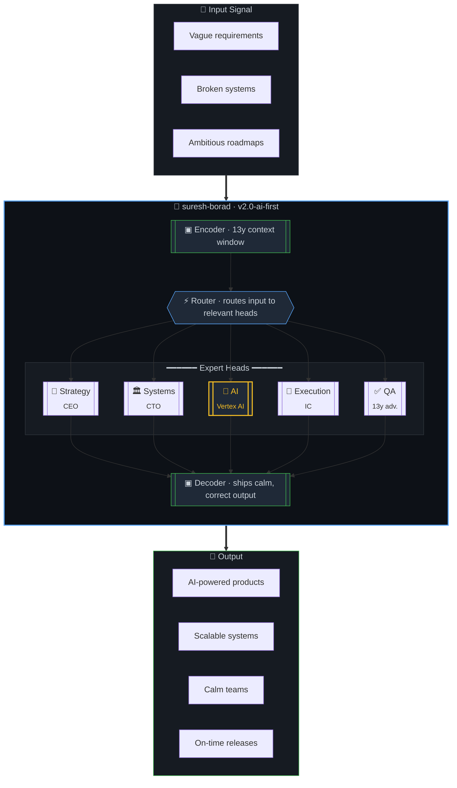

<div align="center">


<a href="https://github.com/suresh-jbt">
  
</a>

<br/>

[](https://www.linkedin.com/in/suresh-borad/)
[](https://www.upwork.com/fl/~018d6d634e5a8b4c18)
[](https://www.jarvisbitz.com)
[](https://www.credly.com/users/suresh-b.f36a48f0/badges)

<sub>`org: suresh-borad` &nbsp;·&nbsp; `role: ceo, cto` &nbsp;·&nbsp; `status: 🟢 available` &nbsp;·&nbsp; `latency: ~42ms` &nbsp;·&nbsp; `region: asia-south1`</sub>

</div>

---

## 🧾 Model Card &nbsp;·&nbsp; `suresh-borad/v2.0-ai-first`

> A production-grade executive model, fine-tuned over 13 years on real-world shipping, scaling, and surviving. Now AI-aligned.

<table>
<tr>
<td width="50%" valign="top">

```yaml
model:       suresh-borad
version:     2.0-ai-first
released:    2013 → continuously updated
params:      13B+ (hours of experience)
context:     256K (multi-project parallel)
modality:    strategy · code · team · product
languages:   JS/TS · Python · English
license:     open to collaborate
maintainer:  JarvisBitz Tech
```

</td>
<td width="50%" valign="top">

```yaml
architecture:
  - strategy_head:  ceo-optimized
  - systems_head:   cto-optimized
  - ai_head:        vertex-ai · prompt-design
  - qa_head:        13y-adversarial
  - execution_head: ic-muscle-memory

training_corpus:
  - enterprise (b2b saas)
  - startups   (0 → 1)
  - mobile · realtime · webxr · ai
  - 100+ shipped products

alignment:       RLHF from customer feedback
safety:          post-incident hardened
eval:            see §Benchmarks below
```

</td>
</tr>
</table>

---

##  Pull Request #∞ &nbsp;·&nbsp; `suresh-borad:main` → `your-network:main`

> **🟢 Open** &nbsp;·&nbsp; **Ready to merge** &nbsp;·&nbsp; **No conflicts detected** &nbsp;·&nbsp; *opened 13+ years ago, continuously rebased*

**Description** — This PR introduces a battle-tested CEO / CTO into your professional network. A decade of shipping scalable systems across web, mobile, realtime, and XR — then in **2022 merged the `ai-engineering` branch into `main`** and has been compounding on **Vertex AI**, **Generative AI**, **Prompt Engineering**, and **Cloud Security** ever since.

> 💡 *Reviewers will find no blocking comments. The author responds faster than most CI pipelines.*

---

## 🧠 Architecture &nbsp;·&nbsp; <code>multi-head expert system</code>



---

## 🤖 Fine-Tuning Run &nbsp;·&nbsp; <kbd>checkpoint: 2022 · AI-first</kbd>

Since 2022 the roadmap has been AI-first. Verified Google Cloud skill badges and Credly-verified skills below.

<table>
<tr>
<td align="center" width="50%">

<a href="https://www.credly.com/badges/744497bf-8661-4d17-92ce-dff80dd7f5e6/public_url">
  
</a>

<sub>Skill Badge · Vertex AI prompt engineering,<br/>few-shot + chain-of-thought, Gemini</sub>

</td>
<td align="center" width="50%">

<a href="https://www.credly.com/badges/3da7be53-c4cb-4a07-a065-691e65bca7c6/public_url">
  
</a>

<sub>Skill Badge · Mitigating threats<br/>& vulnerabilities in Google Cloud</sub>

</td>
</tr>
</table>

<div align="center">

**Credly-verified skills** &nbsp;·&nbsp; [view all →](https://www.credly.com/users/suresh-b.f36a48f0/badges)

[](https://www.credly.com/users/suresh-b.f36a48f0/badges)
[](https://www.credly.com/users/suresh-b.f36a48f0/badges)
[](https://www.credly.com/users/suresh-b.f36a48f0/badges)
[](https://www.credly.com/users/suresh-b.f36a48f0/badges)

</div>

---

## 📡 API Reference &nbsp;·&nbsp; `how to invoke`

```http
POST https://network.suresh-borad.dev/v2/engage
Authorization: Bearer <warm-intro>
Content-Type:  application/json

{
  "intent":    "build-something-together",
  "domain":    "ai | saas | mobile | realtime",
  "timeline":  "yesterday | this-quarter | strategic",
  "stack":     ["angular", "react-native", "node", "vertex-ai"]
}
```

```http
← 200 OK · 42ms

{
  "availability": "open for select collaborations",
  "channels": {
    "recruiters":  "linkedin.com/in/suresh-borad",
    "clients":     "upwork.com/fl/~018d6d634e5a8b4c18",
    "enterprise":  "jarvisbitz.com"
  },
  "response_sla": "within 1 business day"
}
```

---

## 📂 Capabilities &nbsp;·&nbsp; <kbd>+∞ −0</kbd>

<table>
<tr><td width="50%" valign="top">

<details open>
<summary><b>📁 <code>/stack/ai</code></b> &nbsp;·&nbsp; <em>🆕 since 2022</em></summary>

```
├── vertex-ai/            ★★★★☆  prompt design ✓
├── generative-ai/        ★★★★☆  verified ✓
├── prompt-engineering/   ★★★★☆  verified ✓
├── nlp/                  ★★★☆☆  learning
├── edge-computing/       ★★★☆☆  learning
└── llm-integrations/     ★★★★☆  shipping
```
</details>

<details>
<summary><b>📁 <code>/stack/cloud</code></b> &nbsp;·&nbsp; <em>🆕 post-2022</em></summary>

```
├── google-cloud/         ★★★★☆
├── security-cmd-center/  ★★★★☆  verified ✓
├── vertex-ai/            ★★★★☆
└── threat-mitigation/    ★★★★☆  verified ✓
```
</details>

<details>
<summary><b>📁 <code>/stack/frontend</code></b> &nbsp;·&nbsp; <em>daily driver</em></summary>

```
├── angular.ts            ★★★★★  expert
├── react-native.tsx      ★★★★☆  experienced
├── vue.js                ★★★☆☆  intermediate
├── electron.js           ★★★★☆  experienced
├── gatsby.js             ★★★★☆  experienced
└── meteor.js             ★★★★☆  experienced
```
</details>

<details>
<summary><b>📁 <code>/stack/realtime-3d</code></b> &nbsp;·&nbsp; <em>the fun stuff</em></summary>

```
├── webrtc/               ★★★☆☆  intermediate
├── socket.io/            ★★★★☆  experienced
├── webxr/                ★★★★☆  AR/VR experienced
├── three.js/             ★★★☆☆  intermediate
└── d3.js/                ★★★☆☆  intermediate
```
</details>

</td><td width="50%" valign="top">

<details open>
<summary><b>📁 <code>/stack/backend</code></b></summary>

```
├── node.js               ★★★★☆
├── rest-apis             ★★★★★
├── graphql               ★★★★☆
├── deno                  ★★★☆☆
└── socket.io             ★★★★☆
```
</details>

<details>
<summary><b>📁 <code>/stack/languages</code></b></summary>

```
├── javascript.js         ★★★★★  expert
├── typescript.ts         ★★★★☆  experienced
├── python.py             ★★★☆☆  intermediate (↑ AI era)
└── graphql.gql           ★★★★☆  experienced
```
</details>

<details>
<summary><b>📁 <code>/stack/data</code></b></summary>

```
├── mysql                 ★★★★☆
├── mongodb               ★★★★☆
├── couchdb               ★★★★☆
├── pouchdb               ★★★★☆
└── indexeddb             ★★★★☆
```
</details>

<details>
<summary><b>📁 <code>/stack/devops</code></b></summary>

```
├── git                   ★★★★★
├── docker                ★★★☆☆
├── ci-cd                 ★★★★☆
├── cypress + mocha       ★★★★☆
└── jest + enzyme         ★★★★☆
```
</details>

</td></tr>
</table>

---

## 📊 Benchmarks &nbsp;·&nbsp; <code>18 / 18 passed · eval harness: real-world</code>

| Benchmark | Score | Verified by |
|---|---|---|
| 🤖 `vertex-ai / prompt-design` | **✅ pass** | [Google Cloud · Credly](https://www.credly.com/badges/744497bf-8661-4d17-92ce-dff80dd7f5e6/public_url) |
| 🔐 `gcp / security-cmd-center` | **✅ pass** | [Google Cloud · Credly](https://www.credly.com/badges/3da7be53-c4cb-4a07-a065-691e65bca7c6/public_url) |
| `lang / javascript-2024` | ✅ pass | [Udemy](https://www.udemy.com/certificate/UC-603994c6-b58e-448d-b8bb-374737d85e0d/) |
| `lang / typescript` | ✅ pass | [Udemy](https://www.udemy.com/certificate/UC-f518d4d6-7309-4380-a2af-41e53b55dca0/) |
| `framework / angular-2024` | ✅ pass | [Udemy](https://www.udemy.com/certificate/UC-0a90eafe-7c5d-4acf-88bf-3354eec9cbf1/) |
| `framework / react-nextjs-redux` | ✅ pass | [Udemy](https://www.udemy.com/certificate/UC-445cf5b8-2199-4893-b96b-dbe08d5010b6/) |
| `framework / react-ssr-redux` | ✅ pass | [Udemy](https://www.udemy.com/certificate/UC-7235684e-3103-4916-9c8a-fcd0d21f767d/) |
| `mobile / react-native-hooks` | ✅ pass | [Udemy](https://www.udemy.com/certificate/UC-a3601671-825f-4061-b54c-8b10f5a0d197/) |
| `mobile / react-native-ci-cd` | ✅ pass | [Udemy](https://www.udemy.com/certificate/UC-c903152a-9773-48d3-aaef-fe82deca66cf/) |
| `backend / node-rest-graphql-deno` | ✅ pass | [Udemy](https://www.udemy.com/certificate/UC-99e809d6-76aa-4e28-b940-16f27b5c4458) |
| `data / mongodb-2024` | ✅ pass | [Udemy](https://www.udemy.com/certificate/UC-4316411d-b45c-4d3a-8be6-f28ddbf42184/) |
| `data / mysql-bootcamp` | ✅ pass | [Udemy](https://www.udemy.com/certificate/UC-de8cb957-dce3-4249-b6bb-e998f742e915/) |
| `security / mysql-pen-test` | ✅ pass | [Udemy](https://www.udemy.com/certificate/UC-459e46b8-3af4-4c2b-a8b0-8fadc2dc93b1/) |
| `xr / a-frame-webvr` | ✅ pass | [Udemy](https://www.udemy.com/certificate/UC-e89412aa-149c-4711-9879-06adcfee594f/) |
| `xr / threejs-webxr` | ✅ pass | [Udemy](https://www.udemy.com/certificate/UC-cd17ee9e-5bd1-483c-907d-45933cda4d79/) |
| `cicd / devops-pipeline` | ✅ pass | [Udemy](https://www.udemy.com/certificate/UC-0efe6f15-371c-41b3-b485-ed747401e395/) |
| `test / cypress-mocha-cucumber` | ✅ pass | [Udemy](https://www.udemy.com/certificate/UC-857b7be8-2fca-4699-86fc-55cf89b43788/) |
| `test / jest-enzyme-react` | ✅ pass | [Udemy](https://www.udemy.com/certificate/UC-e1173015-094a-4302-aef7-c00a049162f0/) |

---

## 📜 Training History &nbsp;·&nbsp; <code>git log --oneline --graph</code>


---

## 💻 Inference Example

```python
>>> from network import suresh_borad
>>> ceo = suresh_borad.load(version="2.0-ai-first", region="asia-south1")

>>> ceo.capabilities
['strategy', 'systems-design', 'ai-engineering', 'execution', 'qa']

>>> ceo.engage(
...     problem="scale product + integrate AI without breaking the team",
...     constraints={"timeline": "this quarter", "team_size": "small"}
... )
<Response 200 OK · 42ms>
{
  "recommendation": "Let's architect this end-to-end.",
  "first_steps":    ["align on north-star metric", "instrument, then decide"],
  "next_meeting":   "available this week"
}
```

---

## 📈 Runtime Metrics

<div align="center">

<table>
<tr>
<td></td>
<td></td>
</tr>
<tr>
<td colspan="2"></td>
</tr>
</table>

</div>

---

## ⚠️ Limitations &nbsp;·&nbsp; <code>honest eval</code>

- **Not a clairvoyant.** Needs context to give good answers — ambiguous inputs return clarifying questions, not guesses.
- **Opinionated on architecture.** 13 years of scars; will push back on designs likely to hurt in year two.
- **Single-instance deployment.** Cannot be forked. Can be paired with a capable team.
- **Prefers calm ops.** High-drama environments reduce throughput for everyone, not just this model.

---

## 📫 Deploy

<table>
<tr>
<td align="center" width="33%">
  <b>💼 Recruiters / Partners</b><br/>
  <a href="https://www.linkedin.com/in/suresh-borad/">LinkedIn</a>
</td>
<td align="center" width="33%">
  <b>🧑‍💻 Clients</b><br/>
  <a href="https://www.upwork.com/fl/~018d6d634e5a8b4c18">Upwork</a>
</td>
<td align="center" width="33%">
  <b>🏢 Enterprise</b><br/>
  <a href="https://www.jarvisbitz.com">jarvisbitz.com</a>
</td>
</tr>
</table>

---

<div align="center">

### 🟢 &nbsp;<kbd>&nbsp;&nbsp;Merge pull request&nbsp;&nbsp;</kbd> &nbsp; · &nbsp; <kbd>&nbsp;&nbsp;Deploy model&nbsp;&nbsp;</kbd> &nbsp; · &nbsp; <kbd>&nbsp;&nbsp;Request changes&nbsp;&nbsp;</kbd>

*This model auto-rebases on new experience. Last checkpoint: today.*

<sub>✨ Crafted with care · Markdown, Mermaid, 13 years of compute</sub>


</div>
