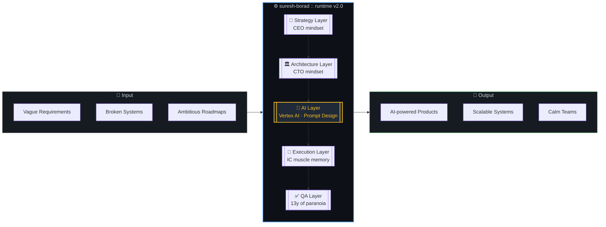
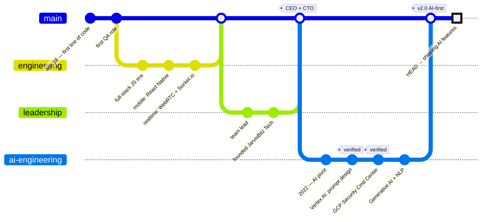

<div align="center">

<a href="https://github.com/suresh-jbt">
  
</a>

<br/>

[](https://www.linkedin.com/in/suresh-borad/)
[](https://www.upwork.com/fl/~018d6d634e5a8b4c18)
[](https://www.jarvisbitz.com)
[](https://www.credly.com/users/suresh-b.f36a48f0/badges)

</div>

---

##  Pull Request #∞ &nbsp;·&nbsp; `suresh-borad:main` → `your-network:main`

> **🟢 Open** &nbsp;·&nbsp; **Ready to merge** &nbsp;·&nbsp; **No conflicts detected** &nbsp;·&nbsp; *opened 13+ years ago, continuously updated*

### 📝 Description

This PR introduces a battle-tested **CEO / CTO** into your professional network. The author spent a decade shipping scalable systems across web, mobile, realtime, and XR — then in **2022 merged the `ai-engineering` branch into `main`** and has been compounding on Vertex AI, Generative AI, Prompt Engineering, and Cloud Security ever since.

> 💡 *Reviewers will find no blocking comments. The author responds faster than your CI pipeline.*

---

### 🏗️ System Architecture (of me)



---

### 🤖 Post-2022 Focus &nbsp;·&nbsp; <kbd>branch: ai-engineering</kbd>

Since 2022 the roadmap has been AI-first. Below are the **verified Google Cloud skill badges** and **Credly-verified skills** backing it up.

<table>
<tr>
<td align="center" width="50%">

<a href="https://www.credly.com/badges/744497bf-8661-4d17-92ce-dff80dd7f5e6/public_url">
  
</a>

<sub>Skill Badge · Vertex AI prompt engineering,<br/>few-shot + chain-of-thought design, Gemini</sub>

</td>
<td align="center" width="50%">

<a href="https://www.credly.com/badges/3da7be53-c4cb-4a07-a065-691e65bca7c6/public_url">
  
</a>

<sub>Skill Badge · Mitigating threats &<br/>vulnerabilities in Google Cloud</sub>

</td>
</tr>
</table>

<div align="center">

**Credly-verified skills** &nbsp;·&nbsp; [view all →](https://www.credly.com/users/suresh-b.f36a48f0/badges)

[](https://www.credly.com/users/suresh-b.f36a48f0/badges)
[](https://www.credly.com/users/suresh-b.f36a48f0/badges)
[](https://www.credly.com/users/suresh-b.f36a48f0/badges)
[](https://www.credly.com/users/suresh-b.f36a48f0/badges)

</div>

---

### 📂 Files changed &nbsp;·&nbsp; <kbd>+∞ −0</kbd>

<table>
<tr><td>

<details open>
<summary><b>📁 <code>/stack/ai</code></b> &nbsp;·&nbsp; <em>🆕 since 2022</em></summary>

```
├── vertex-ai/            ★★★★☆  prompt design
├── generative-ai/        ★★★★☆  verified
├── prompt-engineering/   ★★★★☆  verified
├── nlp/                  ★★★☆☆  learning
├── edge-computing/       ★★★☆☆  learning
└── llm-integrations/     ★★★★☆  shipping
```
</details>

<details>
<summary><b>📁 <code>/stack/cloud</code></b> &nbsp;·&nbsp; <em>🆕 post-2022</em></summary>

```
├── google-cloud/         ★★★★☆
├── security-cmd-center/  ★★★★☆  verified
├── vertex-ai/            ★★★★☆
└── threat-mitigation/    ★★★★☆  verified
```
</details>

<details>
<summary><b>📁 <code>/stack/frontend</code></b> &nbsp;·&nbsp; <em>daily driver</em></summary>

```
├── angular.ts            ★★★★★  expert
├── react-native.tsx      ★★★★☆  experienced
├── vue.js                ★★★☆☆  intermediate
├── electron.js           ★★★★☆  experienced
├── gatsby.js             ★★★★☆  experienced
└── meteor.js             ★★★★☆  experienced
```
</details>

<details>
<summary><b>📁 <code>/stack/realtime-3d</code></b> &nbsp;·&nbsp; <em>the fun stuff</em></summary>

```
├── webrtc/               ★★★☆☆  intermediate
├── socket.io/            ★★★★☆  experienced
├── webxr/                ★★★★☆  AR/VR experienced
├── three.js/             ★★★☆☆  intermediate
└── d3.js/                ★★★☆☆  intermediate
```
</details>

</td><td>

<details open>
<summary><b>📁 <code>/stack/backend</code></b></summary>

```
├── node.js               ★★★★☆
├── rest-apis             ★★★★★
├── graphql               ★★★★☆
├── deno                  ★★★☆☆
└── socket.io             ★★★★☆
```
</details>

<details>
<summary><b>📁 <code>/stack/languages</code></b></summary>

```
├── javascript.js         ★★★★★  expert
├── typescript.ts         ★★★★☆  experienced
├── python.py             ★★★☆☆  intermediate (↑ AI era)
└── graphql.gql           ★★★★☆  experienced
```
</details>

<details>
<summary><b>📁 <code>/stack/data</code></b></summary>

```
├── mysql                 ★★★★☆
├── mongodb               ★★★★☆
├── couchdb               ★★★★☆
├── pouchdb               ★★★★☆
└── indexeddb             ★★★★☆
```
</details>

<details>
<summary><b>📁 <code>/stack/devops</code></b></summary>

```
├── git                   ★★★★★
├── docker                ★★★☆☆
├── ci-cd                 ★★★★☆
├── cypress + mocha       ★★★★☆
└── jest + enzyme         ★★★★☆
```
</details>

</td></tr>
</table>

---

### ✅ Checks &nbsp;·&nbsp; <code>18 / 18 passed</code>

| Check | Status | Source |
|---|---|---|
| 🤖 `ai / prompt-design-vertex-ai` | ✅ **verified** | [Google Cloud · Credly](https://www.credly.com/badges/744497bf-8661-4d17-92ce-dff80dd7f5e6/public_url) |
| 🔐 `security / gcp-security-cmd-center` | ✅ **verified** | [Google Cloud · Credly](https://www.credly.com/badges/3da7be53-c4cb-4a07-a065-691e65bca7c6/public_url) |
| `build / javascript` | ✅ passed | [Udemy · 2024](https://www.udemy.com/certificate/UC-603994c6-b58e-448d-b8bb-374737d85e0d/) |
| `build / typescript` | ✅ passed | [Udemy](https://www.udemy.com/certificate/UC-f518d4d6-7309-4380-a2af-41e53b55dca0/) |
| `build / angular-2024` | ✅ passed | [Udemy](https://www.udemy.com/certificate/UC-0a90eafe-7c5d-4acf-88bf-3354eec9cbf1/) |
| `build / react-nextjs-redux` | ✅ passed | [Udemy · 2024](https://www.udemy.com/certificate/UC-445cf5b8-2199-4893-b96b-dbe08d5010b6/) |
| `build / react-ssr-redux` | ✅ passed | [Udemy](https://www.udemy.com/certificate/UC-7235684e-3103-4916-9c8a-fcd0d21f767d/) |
| `build / react-native-hooks` | ✅ passed | [Udemy](https://www.udemy.com/certificate/UC-a3601671-825f-4061-b54c-8b10f5a0d197/) |
| `build / react-native-ci-cd` | ✅ passed | [Udemy](https://www.udemy.com/certificate/UC-c903152a-9773-48d3-aaef-fe82deca66cf/) |
| `build / node-rest-graphql-deno` | ✅ passed | [Udemy](https://www.udemy.com/certificate/UC-99e809d6-76aa-4e28-b940-16f27b5c4458) |
| `build / mongodb-2024` | ✅ passed | [Udemy](https://www.udemy.com/certificate/UC-4316411d-b45c-4d3a-8be6-f28ddbf42184/) |
| `build / mysql-bootcamp` | ✅ passed | [Udemy](https://www.udemy.com/certificate/UC-de8cb957-dce3-4249-b6bb-e998f742e915/) |
| `security / mysql-pen-testing` | ✅ passed | [Udemy](https://www.udemy.com/certificate/UC-459e46b8-3af4-4c2b-a8b0-8fadc2dc93b1/) |
| `build / a-frame-webvr` | ✅ passed | [Udemy](https://www.udemy.com/certificate/UC-e89412aa-149c-4711-9879-06adcfee594f/) |
| `build / threejs-webxr` | ✅ passed | [Udemy](https://www.udemy.com/certificate/UC-cd17ee9e-5bd1-483c-907d-45933cda4d79/) |
| `cicd / devops-pipeline` | ✅ passed | [Udemy](https://www.udemy.com/certificate/UC-0efe6f15-371c-41b3-b485-ed747401e395/) |
| `test / cypress-mocha-cucumber` | ✅ passed | [Udemy](https://www.udemy.com/certificate/UC-857b7be8-2fca-4699-86fc-55cf89b43788/) |
| `test / jest-enzyme-react` | ✅ passed | [Udemy](https://www.udemy.com/certificate/UC-e1173015-094a-4302-aef7-c00a049162f0/) |

---

### 📜 Commit history &nbsp;·&nbsp; <code>git log --oneline --graph</code>



---

### 📊 Coverage report

<div align="center">

<table>
<tr>
<td></td>
<td></td>
</tr>
<tr>
<td colspan="2"></td>
</tr>
</table>

</div>

---

### 👀 Reviewers requested

<table>
<tr>
<td align="center" width="33%">
  <b>💼 Recruiters / Partners</b><br/>
  <a href="https://www.linkedin.com/in/suresh-borad/">LinkedIn</a>
</td>
<td align="center" width="33%">
  <b>🧑‍💻 Clients</b><br/>
  <a href="https://www.upwork.com/fl/~018d6d634e5a8b4c18">Upwork</a>
</td>
<td align="center" width="33%">
  <b>🏢 Business inquiries</b><br/>
  <a href="https://www.jarvisbitz.com">jarvisbitz.com</a>
</td>
</tr>
</table>

---

### 💬 Review comments

> **Q: What are you currently shipping?**
> Scaling JarvisBitz Tech's flagship product and wiring AI-driven features into the core — prompt-designed flows on Vertex AI, smarter user journeys, fewer support tickets.

> **Q: What are you learning?**
> Advanced ML — NLP, Edge Computing, and LLM-native application patterns.

> **Q: Ask me about…**
> AI product architecture, prompt engineering in production, software architecture, project management, and QA strategy that actually scales.

> **Q: Fun fact?**
> Wrote my first program at 18 — a desktop app to schedule my own tasks. Automation addiction started early.

---

<div align="center">

### 🟢 &nbsp;<kbd>&nbsp;&nbsp;Merge pull request&nbsp;&nbsp;</kbd> &nbsp; or &nbsp; <kbd>&nbsp;&nbsp;Request changes&nbsp;&nbsp;</kbd>

*This PR auto-rebases on new experience. Last force-push: today.*

<sub>✨ Crafted with care · powered by Markdown, Mermaid, and 13 years of muscle memory</sub>

</div>
